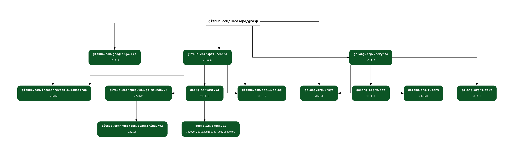

# modgv

[](https://goreportcard.com/report/github.com/lucasepe/modgv) &nbsp;&nbsp;&nbsp; [](https://gocover.io/_badge/github.com/lucasepe/modgv?nocache=modgv) &nbsp;&nbsp;&nbsp; [](https://pkg.go.dev/github.com/lucasepe/modgv?tab=doc) &nbsp;&nbsp;&nbsp; [](https://github.com/avelino/awesome-go#package-management)

Converts 'go mod graph' output into [GraphViz](https://graphviz.gitlab.io/download/)'s DOT language.

- takes no options or arguments
- it reads the output generated by “go mod graph” on stdin
- generates a DOT language and writes to stdout

## Usage:

```bash
go mod graph | modgv | dot -Tpng -o graph.png
```

For each module:
- the node representing the greatest version (i.e., the version chosen by Go's MVS algorithm) is colored green
- other nodes, which aren't in the final build list, are colored grey

## Installation

```bash
go install github.com/lucasepe/modgv/modgv@latest
```

Here 👉 https://graphviz.gitlab.io/download/ how to install [GraphViz](https://graphviz.gitlab.io/download/) for your OS.

## Sample output (PNG)

```bash
go mod graph | modgv | dot -Tpng -o graph.png
```



---

## Sample output (PDF with clickable links to module docs)

```bash
go mod graph | modgv | dot -Tps2 -o graph.ps
ps2pdf graph.ps graph.pdf
```


